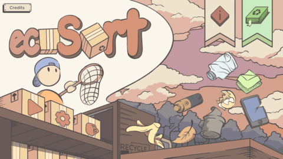

## About the game

Warning! The earth is in danger with all this trash around us! But fear not, to save the planet, we trust you to become our new eco-sorters!

In this mission, all eco-sorters will experience the excitement of sorting various trash, from organic, non-organic, and B3 trash.

#### Help Mr. Kreiner! 

Mr. Kreiner needs your help with cleaning up the environment! This Trash are scattered everywhere and needs to be recycled to appropriate boxes. 

#### Learn Various Types of Trash! 

By sorting various trash you'll meet familiar trash and learn where to sort and recycle them by color and Material! (Green, Yellow, Red)

#### Interactive Fun Gameplay! 

Ecosort provides a Fun and exciting experience through Easy and unique gameplay mechanics! Grab and Pack the trash into boxes to ship them to the nearest recycling center! Play through different levels ranging from easy to challenging difficulty!

## What I worked on
In this project, I mainly worked on player controls and interaction. I developed a WASD movement an created a system where interactable objects are highlighted when in range to provide visual feedback to the player. Additionally, I also worked on the conveyor mechanics by implementing rigidbody for object movement.

I also coordinated with the team's artist in integrating the user interface, to ensure that the ingame design and functionality aligned with the artist's vision.

## Game controls

| Key Binding       | Function          |
| ----------------- | ----------------- |
| W,A,S,D           | Player movement   |
| F                 | Interact          |
| Q                 | Drop trash        |
| Esc               | Pause menu        |

## Scripts

| Script       | Function                                                  |
| ------------------- | ------------------------------------------------------------ |
| `Player.cs` | Manages player movement and interaction input (picking and dropping objects). |
| `Pickables.cs`  | Determines the type of trash and manages object parenting when picked up by player. |
| `TrashCanObject.cs`  | Determines the accepted trash type and manages the object status (filled or not). |
| `ConveyorBelt.cs`  | Moves object along the conveyor using rigidbody. |