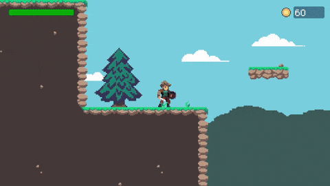

## 🎮 About the game

Mathventures is a 2D turn-based game with roguelike element. The player engages in a combat system where they answer math-related quizzes in a time limit to deal more damage. Players can also obtain more skills from chests or buy stat increases using coins.

#### Fight monsters

Engage in a turn-based combat where the amount of math questions you answer correctly determines your damage.  The stronger enemies you defeat, the more coins you obtain.

#### Obtain loots

Find chests scattered all over the map and open it to obtain new passive skills in your run. Strengthen your character to tackle even more enemies.

#### Upgrade your character

Use the coins obtained from defeating enemies to upgrade your character's base stats at the shop.

## ⬇️ Download game
Itch.io : https://kevinjomin.itch.io/mathventures

## 👤 Developer & contributions
- Dennis Hubert Suwardi - Project Manager
- Kevin Jonathan Mintaryo - Game Programmer
- Calvin Santosa - Game Artist

## 💼 What I worked on
In this project, as a solo programmer I worked on everything pertaining to the game's script. I developed a turn-based battle system in which during the player's turn, a math question gets generated randomly. The battle system determines damage based on the number of correct answer during the player's turn.

In the question generator itself, I made an algorithm where a random question and the correct answer is generated. Then, the algorithm also generate three other incorrect answers and assign each of them to a button.

As this is a turn-based game where the overworld and battle scene are separated, I also made a system ensure game status are synced between the two scenes.

## 🕹️ Game controls

| Key Binding       | Function          |
| ----------------- | ----------------- |
| W,A,S,D           | Player movement   |
| F                 | Open chest        |
| Esc               | Pause menu        |

## 📜 Scripts

| Script       | Function                                                  |
| ------------------- | ------------------------------------------------------------ |
| `BattleSystem.cs` | Manages the state of the battle (setup, player turns, win/lose condition). This scripts also checks for passive abilities the player have and enable them based on the passive's condition. |
| `UnitParameters.cs`  | Manages the unit's current stats (health points and damage) during battle. Also manages visual relating to said unit, which includes sprites and hit effects. |
| `QuestionManager.cs`  | Generates a random question based on selected difficulty, and assign the answers to button UI. |
| `CombatHandler.cs`  | Reads encountered enemy data in the overworld scene and ensures that data gets brought to the battle scene. |
| `LevelManager.cs`  | Pick a stage prefab randomly from a list whenever the player enters the next stage and spawn enemies in the stage This scripts also manages increasing stage multipliers based on current level. |
| `etc`  | |
